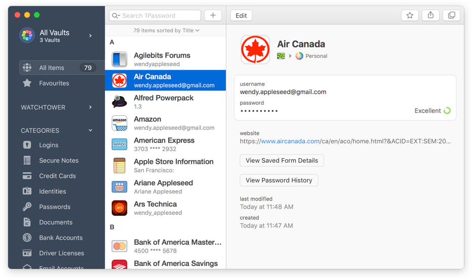

<p align="center">
  
  <br>
  <br>
</p>

# Riot Backend-challenge

Hi there!

Since you got here, you're probably taking a part in our recruitment process for Back-end developer position, right?

We're super happy to hear that! Getting right to it — the main purpose of this test is to check out your backend skills. We'd like to get to know your approach of solving the following problems:

- Understand specs requirements.
- Manipulate Data structure.
- Create a small API in Node.js.
- Create a DB schema.

Feel free to open an issue if you got any questions or suggestions! Once it's ready, send us a repository link at louis@tryriot.com.

Happy coding and cheers,

Louis, CTO @ Riot

## Table of Contents

- [Riot Backend-challenge](#riot-backend-challenge)
  - [Table of Contents](#table-of-contents)
    - [Exercise 1 : Sum Metric Service](#exercise-1--sum-metric-service)
      - [Problem](#problem)
      - [API](#api)
        - [Metrics](#metrics)
      - [Clarifications](#clarifications)
      - [Example](#example)
    - [Exercise 2 : Database Schema](#exercise-2--database-schema)
    - [Exercise 3 : 30 minutes technical interview and debriefing](#exercise-3--30-minutes-technical-interview-and-debriefing)

### Exercise 1 : Sum Metric Service

#### Problem

Build a metric logging and reporting service that sums metrics by time window for the most recent hour. You will build a lightweight web server that implements the two main APIs defined below.

#### API

##### Metrics

**POST metrics**

Request

```curl
POST /metrics/{key}
{
  "value": 30
}
```

Response (200)
{}

**GET metrics sum**

Returns the sum of all metrics reported for this key over the past hour.

Request

```curl
GET /metrics/{key}/sum
```

Response (200)

```curl
{
  "value": 400
}
```

#### Clarifications

- For the sake of the problem, persistence is not required. Therefore don't use a database but just use in-memory data structures or file storage only.
- Unless you have a strong preference otherwise, just use a simple webserver like Express.
- You should optimize for both readability of your code and performance.
- All values will be rounded to the nearest integer.
- You can get rid of any reported data after it is more than an hour old since we only need up to the most recent hour.

#### Example

Imagine these are the events logged to your service for a metric "active_visitors" -

```curl

// 2 hours ago **
POST ​/metrics/​active_visitors { ​"value"​ = ​4​ }

// 30 minutes ago
POST ​/metrics/​active_visitors { ​"value"​ = ​3​ }

// 40 seconds ago
POST ​/metrics/​active_visitors { ​"value"​ = ​7​ }

// 5 seconds ago
POST ​/metrics/​active_visitors { ​"value"​ = ​2​ }

```

These are the results expected from calling get aggregates:

```curl

GET ​/metrics/​active_visitors​/sum // returns 12

```

** Note that the metric posted 2 hours ago is not included in the sum since we only care about data in the most recent hour for these APIs.

### Exercise 2 : Database Schema



According to the screenshot above, create your version of a SQL database schema with <https://drawsql.app/> (don't forget to include a public link to your github repository)

### Exercise 3 : 30 minutes technical interview and debriefing

Once finished, send me your repository link by email: louis@tryriot.com & book a call [HERE](https://calendly.com/louis-cibot/code)
